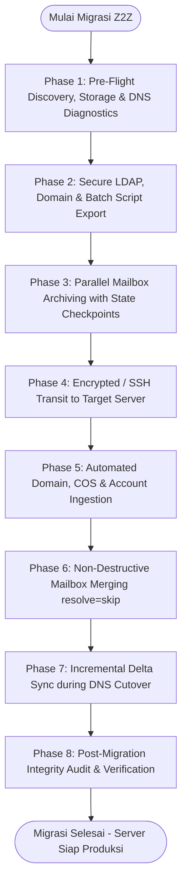

# Z2Z — Zimbra to Zimbra Migration Suite

Enterprise Zero-Timeout, Cross-Version & Zero-Data-Loss Migration Engine for Zimbra Collaboration Suite (ZCS 7.x – 10.1.x & Carbonio CE)

Maintained by **Harry Dertin Sutisna Alsyundawy** | Original Creator **Fabio Soares Schmidt**

[](https://github.com/alsyundawy)
[](https://creativecommons.org/licenses/by-nc-sa/4.0/)
[](https://www.gnu.org/software/bash/)
[](https://github.com/alsyundawy)
[](https://www.shellcheck.net/)
[](https://github.com/alsyundawy)
[](https://wa.me/6285658515212)
[](https://t.me/alsyundawy)
[](https://www.paypal.me/alsyundawy)
[](https://ko-fi.com/alsyundawy)
[](https://github.com/sponsors/alsyundawy)

---

## Overview

**Z2Z (Zimbra to Zimbra Migration Tool)** adalah framework otomasi migrasi mail server enterprise yang dirancang khusus untuk memindahkan seluruh ekosistem **ZCS (Zimbra Collaboration Suite)** maupun **Carbonio CE/FOSS** antar-server, antar-versi (**ZCS 7.x, 8.x, 9.x, 10.0, hingga 10.1.x**), dan antar-distro Linux secara mulus, aman, dan tanpa batasan ukuran mailbox (*zero-timeout*).

Banyak administrator mail server menghadapi kendala saat melakukan upgrade in-place pada sistem operasi yang telah *End-of-Life (EOL)* (seperti CentOS 5/6/7 atau Ubuntu 10.04/12.04/14.04/16.04/18.04), di mana *in-place upgrade* sering merusak database MySQL/MariaDB atau biner OpenLDAP. **Z2Z** menyediakan solusi migrasi terisolasi (*clean-state migration*) dengan mengekstrak seluruh objek direktori LDAP (Email Domains, Global Config, Class of Service, Akun, Hash Password Asli, Mail Alias, Distribution Lists) serta seluruh data mailbox (Email, Kalender, Kontak, Task, Briefcase, Preferences) melalui stream REST API murni, memungkinkan migrasi ke server baru yang bersih tanpa membawa sisa file sampah atau jejak malware dari server lama.

**Ringkasan Keunggulan Flagship Release v1.0.6:**

- **State-Aware Checkpoint & Resume Engine:** Melacak status migrasi per-akun secara dinamis (`.z2z_checkpoint.db`), memungkinkan batch migration yang terinterupsi untuk dilanjutkan seketika tanpa re-export data.
- **Parallel Multi-Worker Orchestrator:** Dukungan worker concurrent (`CONCURRENCY=4..16`) pada ekspor & impor mailbox dengan kontrol beban CPU/RAM dan throttling otomatis.
- **Secure Process-Table Credential Shield:** Menghilangkan ekspresi password terbuka di argumen CLI `ps aux` dengan mekanisme file deskriptor temporer berizin `0600` yang dibersihkan via signal trap.
- **Incremental Delta Mailbox Sync (`util/sync_delta_mailbox.sh`):** Sinkronisasi pesan baru selama jendela cutover DNS menggunakan filter query waktu REST (`after:YYYY/MM/DD`).
- **Pre-Flight Storage & Inode Guard:** Validasi otomatis kapasitas disk dan ketersediaan inode pada mount point target sebelum batch dump dijalankan.
- **Direct Remote SSH Streaming Pipeline (`util/stream_mailbox_direct.sh`):** Streaming stream REST `.tgz` langsung antar-server via SSH tanpa memerlukan penyimpanan staging lokal (menghemat kapasitas disk & I/O).
- **Post-Migration Data Integrity Verifier (`util/verify_migration.sh`):** Validasi otomatis ukuran mailbox dan jumlah folder source vs target dengan laporan audit tabulasi.
- **Maintenance Freeze & Cutover Guard (`util/freeze_source_accounts.sh`):** Mengunci akun sumber ke status `maintenance` selama propagasi DNS untuk mencegah *split-brain delivery*.
- **Generic IMAP to Zimbra Ingestion Wrapper (`util/imapsync_wrapper.sh`):** Otomasi migrasi batch akun dari server non-Zimbra (cPanel, Exchange, Dovecot, Google Workspace) langsung ke Zimbra.
- **Executive HTML Summary Report (`util/generate_migration_report.sh`):** Laporan audit migrasi mandiri berbasis HTML modern dengan metrik statistik storage dan domain breakdown.

---

## Quickstart

Langkah cepat eksekusi migrasi dari server sumber ke server tujuan:

1. **Eksekusi pada Server Sumber (Export Phase):**

   ```bash
   su - zimbra
   cd /path/to/Zimbra2Zimbra-Migration-Tool
   chmod +x z2z.sh func.sh skell/importar_ldap.sh util/*.sh
   ./z2z.sh
   ```

   Setelah ekspor selesai, jalankan batch mailbox export (mendukung paralel worker):

   ```bash
   cd export/
   CONCURRENCY=4 ./script_export_FULL.sh
   ```

2. **Transfer Data ke Server Tujuan:**

   ```bash
   scp -r /path/to/Zimbra2Zimbra-Migration-Tool/export/ zimbra@destination-server:/tmp/export/
   ```

3. **Eksekusi pada Server Tujuan (Import Phase):**

   ```bash
   su - zimbra
   cd /tmp/export/
   ./importar_ldap.sh
   CONCURRENCY=4 ./script_import_FULL.sh
   ```

---

## Dependencies

Skrip didesain secara mandiri (*zero external compilation / pure shell*) menggunakan utilitas bawaan Zimbra dan POSIX Bash 4.1+ hingga 5.x:

- **Ubuntu Linux:** 10.04, 12.04, 14.04, 16.04, 18.04, 20.04, 22.04, 24.04 LTS
- **Debian GNU/Linux:** 6 (Squeeze) hingga 12 (Bookworm) (Kompatibilitas penuh)
- **Enterprise Linux (EL):** RHEL 5/6/7/8/9, CentOS 5/6/7/8/9 Stream, Rocky Linux 8/9, AlmaLinux 8/9, Oracle Linux 7/8/9, SLES 11/12
- **Varian Zimbra Didukung:** ZCS 7.x, 8.0–8.6, 8.7–8.8.15, 9.0.0, 10.0.x, 10.1.x (FOSS / Network Edition), serta Carbonio Community Edition.

---

## Configuration

Ketika server baru menggunakan FQDN yang berbeda dengan server lama (misal: `mail-old.domain.com` ➔ `mail.domain.com`), Z2Z menyediakan modul **Interactive Hostname Replacement**:

```text
Replace Zimbra server hostname (yes/no)? yes
Enter the new Zimbra server hostname: mail.domain.com
[OK] Hostname set to: mail.domain.com
[OK] Hostname replacement completed across DOMINIOS.ldif, CONTAS.ldif, LISTAS.ldif, APELIDOS.ldif, COS.ldif.
```

Modul ini secara otomatis mengganti referensi `zimbraMailHost`, URL LDAP, dan atribut host terkait pada seluruh berkas LDIF sebelum diimpor ke server baru.

---

## Zero-Data-Loss Migration Pipeline



---

## LDAP Provisioning & Directory Objects

| Berkas LDIF | Tipe Objek LDAP | Deskripsi & Komponen Data |
| :--- | :--- | :--- |
| `DOMINIOS.ldif` | `zimbraDomain` | Definisi domain, autentikasi authMech, mode GAL, status domain |
| `CONFIG_GLOBAL.ldif` | `zimbraGlobalConfig` | Konfigurasi server global & MTA restriction snapshot |
| `COS.ldif` | `zimbraCOS` | Kuota akun, batasan fitur webmail, permission protokol IMAP/POP/EWS |
| `CONTAS.ldif` | `zimbraAccount` | Akun pengguna beserta hash password asli (`{SSHA512}`, `{SSHA}`, `{CRYPT}`) |
| `APELIDOS.ldif` | `zimbraAlias` | Pemetaan alamat email alternatif (*email aliases*) |
| `LISTAS.ldif` | `zimbraDistributionList` | Milis, grup distribusi email, dan daftar keanggotaan grup |

Akun internal Zimbra (`spam.*`, `ham.*`, `virus-quarantine.*`, `galsync.*`, `root`, `zimbra`) secara otomatis dikecualikan agar tidak menimpa token dan konfigurasi bawaan server tujuan.

---

## Mailbox REST API Archiving Engine

Pengambilan dan pemulihan data pesan menggunakan endpoint REST API native Zimbra yang terhubung langsung ke Mailboxd:

```bash
# Ekspor mailbox lengkap tanpa batas waktu koneksi (-t 0)
zmmailbox -z -m 'user@domain.com' -t 0 getRestURL "//?fmt=tgz" > "/export/path/user@domain.com.tgz"

# Impor mailbox dengan mode penggabungan aman (resolve=skip)
zmmailbox -z -m 'user@domain.com' -t 0 postRestURL "//?fmt=tgz&resolve=skip" "/export/path/user@domain.com.tgz"
```

Format `.tgz` REST API mempertahankan seluruh hierarki folder kustom, penanda flag/tag, status baca/belum baca, serta item non-email seperti kalender, buku alamat kontak, tugas (*tasks*), dan berkas Briefcase.

---

## Suite of Diagnostic, Migration & Security Utilities

Direktori `util/` menyediakan 17 utilitas operasional yang dapat dijalankan secara mandiri:

```bash
# 1. Pre-Flight DNS Diagnostic & Resolver Reachability Check
./util/dns_diagnostic.sh

# 2. Snapshot Konfigurasi DKIM Per-Domain
./util/export_dkim_keys.sh

# 3. Ekspor & Impor Tanda Tangan Webmail Serta Persona/Identitas Pengguna
./util/export_signatures.sh
./util/import_signatures.sh

# 4. Ekspor & Impor Aturan Filter Email Sieve (zimbraMailSieveScript)
./util/export_sieve_filters.sh
./util/import_sieve_filters.sh

# 5. Ekspor & Impor Status Vacation / Out-of-Office Auto-Reply
./util/export_ooo.sh
./util/import_ooo.sh

# 6. Ekspor & Impor Calendar Resources & Akun Peralatan (Equipment)
./util/export_calendar_resources.sh
./util/import_calendar_resources.sh

# 7. Sinkronisasi Delta Mailbox Berdasarkan Tanggal Cutover
./util/sync_delta_mailbox.sh 2026/08/20 ./export/delta

# 8. Verifikasi & Audit Integritas Data Pasca-Migrasi
./util/verify_migration.sh

# 9. Penguncian Status Akun Sumber ke Maintenance Mode Saat Cutover
./util/freeze_source_accounts.sh --freeze

# 10. Streaming Langsung Mailbox via SSH Tunnel Tanpa Staging Disk
./util/stream_mailbox_direct.sh zimbra@target-server.com

# 11. Otomasi Migrasi Batch Generic IMAP (cPanel/Exchange/Gmail) ke Zimbra
./util/imapsync_wrapper.sh imap.oldserver.com mail.newserver.com accounts.csv

# 12. Laporan Eksekutif HTML Summary Report
./util/generate_migration_report.sh ./export/migration_report.html

# 13. Audit Kapasitas Storage & Forwarding Rules
./util/mailbox_size.sh
./util/audit_forwards.sh
./util/audit_shares.sh

# 14. Penambahan Disclaimer Wajib Per-Domain (ZCS 8.5+)
sudo ./util/add_disclaimer.sh
```

---

## Feature Evolution Matrix

| Fitur / Kemampuan Sistem | v0.9.9 | v1.0.0b | v1.0.1 | v1.0.2 | v1.0.3 | v1.0.4 | v1.0.5 | v1.0.6 (Current) |
| :--- | :---: | :---: | :---: | :---: | :---: | :---: | :---: | :---: |
| **Ekspor Objek Direktori LDAP** | ✅ | ✅ | ✅ | ✅ | ✅ | ✅ | ✅ | **✅ (Lengkap & Secure)** |
| **Bypass Timeout Mailbox Besar (`-t 0`)** | ❌ | ✅ | ✅ | ✅ | ✅ | ✅ | ✅ | **✅ (Unlimited)** |
| **Safe Mailbox Merging (`resolve=skip`)** | ❌ | ✅ | ✅ | ✅ | ✅ | ✅ | ✅ | **✅ (Non-Destructive)** |
| **Dukungan `zimbraGroup` pada Milis** | ❌ | ❌ | ✅ | ✅ | ✅ | ✅ | ✅ | **✅** |
| **Multi-Server Detection Warning** | ❌ | ❌ | ❌ | ✅ | ✅ | ✅ | ✅ | **✅ (Cluster Aware)** |
| **Lokalisasi Bahasa Inggris Penuh** | ❌ | ❌ | ❌ | ❌ | ✅ | ✅ | ✅ | **✅** |
| **Audit ShellCheck & Linter Sempurna** | ❌ | ❌ | ❌ | ❌ | ✅ | ✅ | ✅ | **✅ (0 Warning)** |
| **Automated Domain Migration** | ❌ | ❌ | ❌ | ❌ | ❌ | ✅ | ✅ | **✅ (Auto Provision)** |
| **Mailbox Filter Modes (Active/Domain)** | ❌ | ❌ | ❌ | ❌ | ❌ | ✅ | ✅ | **✅ (Interactive)** |
| **Global Config & MTA Snapshot** | ❌ | ❌ | ❌ | ❌ | ❌ | ✅ | ✅ | **✅** |
| **Shared Folders & Calendar Audit** | ❌ | ❌ | ❌ | ❌ | ❌ | ✅ | ✅ | **✅ (`audit_shares.sh`)** |
| **Single-Pass Atomic Alias Export** | ❌ | ❌ | ❌ | ❌ | ❌ | ✅ | ✅ | **✅ (Ultra Fast)** |
| **Anchored System Account Shield** | ❌ | ❌ | ❌ | ❌ | ❌ | ✅ | ✅ | **✅ (Zero False-Exclusion)** |
| **Universal LDAP URL Fallback Resolver** | ❌ | ❌ | ❌ | ❌ | ❌ | ✅ | ✅ | **✅ (LDAPS & Custom Port)** |
| **Progress-Aware Batch Script Generator** | ❌ | ❌ | ❌ | ❌ | ❌ | ✅ | ✅ | **✅ (Real-time Logger)** |
| **Portable Stream Replacement (GNU/BSD)** | ❌ | ❌ | ❌ | ❌ | ❌ | ✅ | ✅ | **✅ (All OS)** |
| **Webmail Signatures & Identities** | ❌ | ❌ | ❌ | ❌ | ❌ | ❌ | ✅ | **✅ (`export/import_signatures.sh`)** |
| **Sieve Mail Filters Migration** | ❌ | ❌ | ❌ | ❌ | ❌ | ❌ | ✅ | **✅ (`export/import_sieve_filters.sh`)** |
| **Out-of-Office Vacation Responders** | ❌ | ❌ | ❌ | ❌ | ❌ | ❌ | ✅ | **✅ (Base64 Safe Payload)** |
| **Calendar Resources & Equipment** | ❌ | ❌ | ❌ | ❌ | ❌ | ❌ | ✅ | **✅ (`export/import_calendar_resources.sh`)** |
| **Pre-Flight DNS Diagnostics** | ❌ | ❌ | ❌ | ❌ | ❌ | ❌ | ✅ | **✅ (`dns_diagnostic.sh`)** |
| **DKIM Key Snapshot & Rotation Advisory** | ❌ | ❌ | ❌ | ❌ | ❌ | ❌ | ✅ | **✅ (`export_dkim_keys.sh`)** |
| **State-Aware Checkpoint & Resume Engine** | ❌ | ❌ | ❌ | ❌ | ❌ | ❌ | ❌ | **✅ (`.z2z_checkpoint.db`)** |
| **Parallel Multi-Worker Mailbox Export** | ❌ | ❌ | ❌ | ❌ | ❌ | ❌ | ❌ | **✅ (`CONCURRENCY=4..16`)** |
| **Secure Process-Table Credential Passing** | ❌ | ❌ | ❌ | ❌ | ❌ | ❌ | ❌ | **✅ (`-y` 0600 Temp Descriptors)** |
| **Incremental Delta Mailbox Sync** | ❌ | ❌ | ❌ | ❌ | ❌ | ❌ | ❌ | **✅ (`sync_delta_mailbox.sh`)** |
| **Pre-Flight Storage & Inode Guard** | ❌ | ❌ | ❌ | ❌ | ❌ | ❌ | ❌ | **✅ (`check_disk_capacity`)** |
| **Direct SSH Streaming Pipeline** | ❌ | ❌ | ❌ | ❌ | ❌ | ❌ | ❌ | **✅ (`stream_mailbox_direct.sh`)** |
| **Post-Migration Data Integrity Verifier** | ❌ | ❌ | ❌ | ❌ | ❌ | ❌ | ❌ | **✅ (`verify_migration.sh`)** |
| **Source Maintenance Freeze Mode** | ❌ | ❌ | ❌ | ❌ | ❌ | ❌ | ❌ | **✅ (`freeze_source_accounts.sh`)** |
| **Generic IMAP Ingestion Engine** | ❌ | ❌ | ❌ | ❌ | ❌ | ❌ | ❌ | **✅ (`imapsync_wrapper.sh`)** |
| **Executive HTML Report Generator** | ❌ | ❌ | ❌ | ❌ | ❌ | ❌ | ❌ | **✅ (`generate_migration_report.sh`)** |

---

## Complete Changelog

- **v1.0.6 (2026-08-27) — State Checkpoint & Resume, Parallel Concurrency, Security Shield & Enterprise Suite**
  - **State-Aware Checkpoint & Resume Engine:** Melacak status ekspor/impor per-akun via `.z2z_checkpoint.db`, memungkinkan proses migrasi batch yang terputus dilanjutkan seketika tanpa re-export data.
  - **Parallel Multi-Worker Support:** Menambahkan dukungan konkurensi worker paralel (`CONCURRENCY=4..16`) pada ekspor/impor mailbox.
  - **Secure Password Handling:** Mengeliminasi parameter password terbuka di argumen CLI `ps aux` dengan mekanisme file deskriptor berizin `0600` yang dibersihkan via signal trap.
  - **Incremental Delta Mailbox Sync (`util/sync_delta_mailbox.sh`):** Utilitas migrasi delta berbasis filter query timestamp REST API (`after:YYYY/MM/DD`).
  - **Pre-Flight Disk Capacity Guard (`check_disk_capacity`):** Validasi ruang partisi dan inode pada target mount sebelum batch dump dimulai.
  - **Post-Migration Data Integrity Verifier (`util/verify_migration.sh`):** Audit rekonsiliasi data mailbox dan hierarki folder pasca-migrasi.
  - **Source Account Freeze Mode (`util/freeze_source_accounts.sh`):** Penguncian akun ke maintenance mode selama propagasi DNS.
  - **Direct SSH Streaming Pipeline (`util/stream_mailbox_direct.sh`):** Streaming langsung getRestURL ke postRestURL via SSH tanpa staging disk lokal.
  - **Generic IMAP Ingestion Engine (`util/imapsync_wrapper.sh`):** Wrapper migrasi multi-threaded IMAP ke Zimbra.
  - **Executive HTML Summary Report (`util/generate_migration_report.sh`):** Generator laporan audit migrasi mandiri berbasis HTML modern.
  - **Safe Admin Lockout Protection:** Validasi integritas record admin sebelum penghapusan di `skell/importar_ldap.sh`.
- **v1.0.5 (2026-08-27) — Signatures, Sieve Filters, OOO, Calendar Resources, DNS Diagnostics & Hardening**
  - **Webmail Signatures & Identities Migration:** Menambahkan `util/export_signatures.sh` dan `util/import_signatures.sh` untuk migrasi signature teks dan HTML beserta mapping persona identity.
  - **Sieve Mail Filters Migration:** Menambahkan `util/export_sieve_filters.sh` dan `util/import_sieve_filters.sh` untuk migrasi filter Sieve multi-line secara aman.
  - **Out-of-Office Vacation Auto-Reply:** Menambahkan `util/export_ooo.sh` dan `util/import_ooo.sh` dengan validasi format tanggal `YYYYMMDDHHMMSSZ`.
  - **Calendar Resources & Equipment:** Menambahkan `util/export_calendar_resources.sh` dan `util/import_calendar_resources.sh` untuk provisioning dan ekspor arsip TGZ resource ruangan/peralatan.
  - **Pre-Flight DNS Diagnostic Utility:** Menambahkan `util/dns_diagnostic.sh` untuk validasi menyeluruh MX, SPF, DKIM, DMARC, dan reachability resolver.
  - **DKIM Key Snapshot Utility:** Menambahkan `util/export_dkim_keys.sh` untuk snapshot konfigurasi DKIM per-domain dengan advisory keamanan rotasi kunci.
  - **Code Hardening & Fault Tolerance:** Memperbaiki potensi kegagalan `set -e` pada evaluasi aritmetika bash (`|| true`), merefaktor rekursi tak terbatas menjadi safe loops, dan memperbaiki penanganan berkas temporer.
- **v1.0.4 (2026-08-27) — Automated Domain Migration, Filter Modes, Shares Audit & High-Speed Suite**
  - **Automated Domain Migration:** Ekspor domain via `DOMINIOS.ldif` dan companion provisioning script `create_domains.sh` yang otomatis diimpor di server tujuan.
  - **Flexible Mailbox Filter Modes:** Pilihan filter ekspor akun: semua akun (*all*), akun aktif saja (*active-only*), atau filter berdasarkan domain tertentu.
  - **Global Configuration Snapshot:** Ekspor `CONFIG_GLOBAL.ldif` dan snapshot pengaturan MTA server (`global_settings_snapshot.txt`).
  - **Shared Folders & Calendar Audit:** Penambahan utilitas `util/audit_shares.sh` untuk audit hak akses folder dan kalender bersama.
  - **Single-Pass Atomic Alias Export:** Mengganti loop `ldapsearch` iteratif lambat dengan satu query atomik, memangkas waktu ekspor alias dari 30+ menit menjadi beberapa detik.
  - **Anchored System Account Exclusion:** Memperbaiki regex pengecualian akun sistem menjadi `^(virus-[^@]*|ham\.[^@]*|spam\.[^@]*|galsync[^@]*)@`, mencegah akun bernama `sysadmin@` atau `badminton@` terlewat secara tidak sengaja.
  - **Universal LDAP Resolver:** Menambahkan fungsi fallback `get_ldap_uri()`, `get_ldap_credential()`, dan `get_ldap_binddn()` yang membaca `zmlocalconfig` dan variabel `ldap_url`/`ldap_master_url`.
  - **Progress-Aware Script Generator & Live Run:** Menghasilkan skrip batch ekspor/impor dengan shebang, `set -euo pipefail`, timestamp log real-time, penghitung total akun, dan opsi eksekusi live.
  - **Portable Stream Replacement:** Implementasi `portable_replace()` berbasis staging berkas sementara untuk eliminasi error `sed -i` lintas Linux dan macOS.
  - **Enhanced Diagnostics:** Memperluas `audit_forwards.sh` untuk memeriksa `zimbraMailForwardingAddress`, `zimbraPrefMailForwardingAddress`, dan flag `zimbraPrefMailLocalDelivery`; menyempurnakan `mailbox_size.sh` dengan konversi unit terabyte dinamis.

---

## Running Tests

Untuk memvalidasi integritas sintaks skrip dan kesesuaian format linter:

```bash
# 1. Validasi sintaksis Bash
bash -n z2z.sh func.sh skell/importar_ldap.sh util/*.sh

# 2. Audit statis menggunakan ShellCheck
shellcheck --norc z2z.sh func.sh skell/importar_ldap.sh util/*.sh

# 3. Validasi formatting Markdown
markdownlint -c .trunk/configs/.markdownlint.yaml README.md DOCNOTE.md skell/README.md util/README.md export/README.md TODO INSTALL
```

---

## Post-Migration SOP & System Validation

Setelah proses impor mailbox selesai pada server baru, lakukan langkah-langkah verifikasi berikut:

1. **Validasi Jumlah & Ukuran Mailbox:**
   Jalankan `./util/verify_migration.sh` dan `./util/mailbox_size.sh` pada server baru dan bandingkan hasilnya dengan laporan pra-migrasi pada server lama.
2. **Verifikasi Aturan Penerusan & Folder Bersama:**
   Jalankan `./util/audit_forwards.sh` dan `./util/audit_shares.sh` untuk memastikan seluruh aturan forward dan sharing pengguna aktif dengan benar.
3. **Uji Coba Autentikasi Pengguna:**
   Lakukan login uji coba via Webmail atau IMAP menggunakan password asli pengguna untuk memastikan hash OpenLDAP terimpor sempurna.
4. **Perbaikan Hak Akses Berkas Zimbra:**
   Jalankan perbaikan permission Zimbra secara menyeluruh dengan hak `root`:

   ```bash
   /opt/zimbra/libexec/zmfixperms --extended
   ```

5. **Switching DNS MX & Routing:**
   Setelah data tervalidasi, ubah rekaman DNS MX, SPF, DKIM, dan DMARC ke IP server Zimbra baru.

---

## Security & Architecture Reference

Dokumentasi arsitektur internal, analisis dependensi OpenLDAP, perincian mitigasi CVE, dan panduan audit tersedia di [DOCNOTE.md](DOCNOTE.md). Riwayat seluruh versi tersedia di [CHANGELOG](CHANGELOG).

---

## Community, Support & Sponsorship

Proyek Z2Z terbuka untuk seluruh komunitas administrator mail server dunia. Jika Anda terbantu oleh framework ini dalam migrasi mail server skala produksi, pertimbangkan untuk mendukung kelangsungan pengembangannya:

- **Konsultasi & Dukungan Teknis:** Hubungi [WhatsApp](https://wa.me/6285658515212) atau [Telegram @alsyundawy](https://t.me/alsyundawy)
- **Donasi & Sponsorship:** Dukung pengembangan melalui [GitHub Sponsor](https://github.com/sponsors/alsyundawy), [PayPal](https://www.paypal.me/alsyundawy), atau [Ko-fi](https://ko-fi.com/alsyundawy)

---

## Contributing

Kontribusi dan perbaikan terbuka untuk seluruh komunitas:

1. Fork repositori ini.
2. Buat feature branch baru (`git checkout -b feature/peningkatan-keren`).
3. Pastikan seluruh pengujian lolos: `bash -n *.sh util/*.sh` dan `shellcheck --norc *.sh util/*.sh`.
4. Submit Pull Request dengan penjelasan rinci.

---

## License

Copyright (C) 2016-2026 Fabio Soares Schmidt, Harry Dertin Sutisna Alsyundawy.

Dilisensikan di bawah [Creative Commons Attribution-NonCommercial-ShareAlike 4.0 International (CC BY-NC-SA 4.0)](https://creativecommons.org/licenses/by-nc-sa/4.0/) dan General Public License (GPL).
