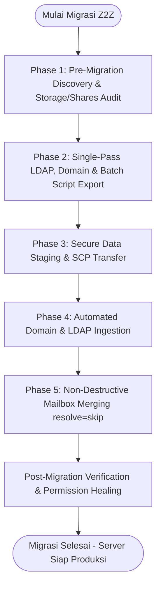

# Z2Z - ZIMBRA TO ZIMBRA MIGRATION SUITE

Enterprise Zero-Timeout, Cross-Version & Zero-Data-Loss Migration Engine for Zimbra Collaboration Suite (ZCS 7.x – 10.1.x & Carbonio)

Maintained by **Harry Dertin Sutisna Alsyundawy** | Original Creator **Fabio Soares Schmidt**

[](https://github.com/alsyundawy)
[](https://creativecommons.org/licenses/by-nc-sa/4.0/)
[](https://www.gnu.org/software/bash/)
[](https://github.com/alsyundawy)
[](https://www.shellcheck.net/)
[](https://github.com/alsyundawy)
[](https://wa.me/6285658515212)
[](https://t.me/alsyundawy)
[](https://www.paypal.me/alsyundawy)
[](https://ko-fi.com/alsyundawy)
[](https://github.com/sponsors/alsyundawy)

---

## Overview

**Z2Z (Zimbra to Zimbra Migration Tool)** adalah framework otomasi migrasi mail server enterprise yang dirancang khusus untuk memindahkan seluruh ekosistem **ZCS (Zimbra Collaboration Suite)** maupun **Carbonio CE/FOSS** antar-server, antar-versi (**ZCS 7.x, 8.x, 9.x, 10.0, hingga 10.1.x**), dan antar-distro Linux secara mulus, aman, dan tanpa batasan ukuran mailbox (*zero-timeout*).

Banyak administrator mail server menghadapi kendala saat melakukan upgrade in-place pada sistem operasi yang telah *End-of-Life (EOL)* (seperti CentOS 5/6/7 atau Ubuntu 10.04/12.04/14.04/16.04/18.04), di mana *in-place upgrade* sering merusak database MySQL/MariaDB atau biner OpenLDAP. **Z2Z** menyediakan solusi migrasi terisolasi (*clean-state migration*) dengan mengekstrak seluruh objek direktori LDAP (Email Domains, Global Config, Class of Service, Akun, Hash Password Asli, Mail Alias, Distribution Lists) serta seluruh data mailbox (Email, Kalender, Kontak, Task, Briefcase, Preferences) melalui stream REST API murni, memungkinkan migrasi ke server baru yang bersih tanpa membawa sisa file sampah atau jejak malware dari server lama.

**Ringkasan Keunggulan Flagship Release v1.0.4:**

- **Automated Domain Migration:** Ekspor dan impor domain otomatis via `DOMINIOS.ldif` dan helper script `create_domains.sh`, mengeliminasi kewajiban pembuatan domain manual di server target sebelum impor LDAP.
- **Atomic Single-Pass Alias Export:** Mengganti ribuan loop sub-query `ldapsearch` lama dengan satu kueri atomik berkecepatan tinggi, memangkas waktu eksekusi ekspor alias dari 30+ menit menjadi hitungan detik.
- **Anchored System Account Shield:** Menggunakan regex berjangkar `^(virus-[^@]*|ham\.[^@]*|spam\.[^@]*|galsync[^@]*)@` yang mencegah *false-positive exclusion* pada akun pengguna sah yang memiliki substring kata "admin" (seperti `badminton@`, `sysadmin@`).
- **Flexible Mailbox Export Filtering:** Pilihan filter akun fleksibel saat ekspor: seluruh akun (*all*), akun aktif saja (*active-only*), atau filter berdasarkan domain spesifik untuk migrasi bertahap.
- **Global Configuration & MTA Snapshot:** Otomatisasi pencatatan konfigurasi global `CONFIG_GLOBAL.ldif` dan `global_settings_snapshot.txt` (relayhost, mynetworks, MTA restrictions, authentication mechanisms).
- **Universal LDAP Connection Fallback:** Mendukung deteksi otomatis `ldap_url`, `ldap_master_url`, dan `zmlocalconfig`, menjamin kompatibilitas penuh pada protokol LDAPS, custom LDAP port (389/636), dan multi-server.
- **Progress-Aware Batch Execution & Live Run Option:** Skrip batch arsip mailbox yang dihasilkan dilengkapi penanda waktu real-time `[$(date)]`, penghitung progres `[X/Y]`, pelacakan error, serta opsi eksekusi live langsung dari menu Z2Z.
- **Mailbox Shares & Resource Audit (`util/audit_shares.sh`):** Utilitas baru untuk memindai seluruh folder bersama, kalender sharing, dan buku alamat terdistribusi antar akun.
- **Portable Cross-Platform Stream Engine:** Fungsi `portable_replace()` berbasis berkas temporer yang kebal terhadap variasi sintaks `sed -i` pada GNU Linux dan BSD/macOS.
- **Technical Manual & Architecture:** Dokumentasi teknis lengkap tersedia di [DOCNOTE.md](DOCNOTE.md) dan riwayat rilis di [CHANGELOG](CHANGELOG).

---

## Quickstart

Langkah cepat eksekusi migrasi dari server sumber ke server tujuan:

1. **Eksekusi pada Server Sumber (Export Phase):**

   ```bash
   su - zimbra
   cd /path/to/Zimbra2Zimbra-Migration-Tool
   chmod +x z2z.sh func.sh skell/importar_ldap.sh util/*.sh
   ./z2z.sh
   ```

   Setelah ekspor selesai, jalankan batch mailbox export:

   ```bash
   cd export/
   ./script_export_FULL.sh
   ```

2. **Transfer Data ke Server Tujuan:**

   ```bash
   scp -r /path/to/Zimbra2Zimbra-Migration-Tool/export/ zimbra@destination-server:/tmp/export/
   ```

3. **Eksekusi pada Server Tujuan (Import Phase):**

   ```bash
   su - zimbra
   cd /tmp/export/
   ./importar_ldap.sh
   ./script_import_FULL.sh
   ```

---

## Dependencies

Skrip didesain secara mandiri (*zero external compilation / pure shell*) menggunakan utilitas bawaan Zimbra dan POSIX Bash 4.1+ hingga 5.x:

- **Ubuntu Linux:** 10.04, 12.04, 14.04, 16.04, 18.04, 20.04, 22.04, 24.04 LTS
- **Debian GNU/Linux:** 6 (Squeeze), 7 (Wheezy), 8 (Jessie), 9 (Stretch), 10 (Buster), 11 (Bullseye), 12 (Bookworm) (Kompatibilitas penuh)
- **Enterprise Linux (EL):** RHEL 5/6/7/8/9, CentOS 5/6/7/8/9 Stream, Rocky Linux 8/9, AlmaLinux 8/9, Oracle Linux 7/8/9, SLES 11/12
- **Varian Zimbra Didukung:** ZCS 7.x, 8.0–8.6, 8.7–8.8.15, 9.0.0, 10.0.x, 10.1.x (FOSS / NE), serta Carbonio Community Edition.

---

## Configuration

Ketika server baru menggunakan FQDN yang berbeda dengan server lama (misal: `mail-old.domain.com` ➔ `mail.domain.com`), Z2Z menyediakan modul **Interactive Hostname Replacement**:

```text
Replace Zimbra server hostname (yes/no)? yes
Enter the new Zimbra server hostname: mail.domain.com
[OK] Hostname set to: mail.domain.com
[OK] Hostname replacement completed across DOMINIOS.ldif, CONTAS.ldif, LISTAS.ldif, APELIDOS.ldif, COS.ldif.
```

Modul ini secara otomatis mengganti referensi `zimbraMailHost`, URL LDAP, dan atribut host terkait pada seluruh berkas LDIF sebelum diimpor ke server baru.

---

## Zero-Data-Loss Migration Pipeline



---

## LDAP Provisioning & Directory Objects

| Berkas LDIF | Tipe Objek LDAP | Deskripsi & Komponen Data |
| :--- | :--- | :--- |
| `DOMINIOS.ldif` | `zimbraDomain` | Definisi domain, autentikasi authMech, mode GAL, status domain |
| `CONFIG_GLOBAL.ldif` | `zimbraGlobalConfig` | Konfigurasi server global & MTA restriction snapshot |
| `COS.ldif` | `zimbraCOS` | Kuota akun, batasan fitur webmail, permission protokol IMAP/POP/EWS |
| `CONTAS.ldif` | `zimbraAccount` | Akun pengguna beserta hash password asli (`{SSHA512}`, `{SSHA}`, `{CRYPT}`) |
| `APELIDOS.ldif` | `zimbraAlias` | Pemetaan alamat email alternatif (*email aliases*) |
| `LISTAS.ldif` | `zimbraDistributionList` | Milis, grup distribusi email, dan daftar keanggotaan grup |

Akun internal Zimbra (`spam.*`, `ham.*`, `virus-quarantine.*`, `galsync.*`, `root`, `zimbra`) secara otomatis dikecualikan agar tidak menimpa token dan konfigurasi bawaan server tujuan.

---

## Mailbox REST API Archiving Engine

Pengambilan dan pemulihan data pesan menggunakan endpoint REST API native Zimbra yang terhubung langsung ke Mailboxd:

```bash
# Ekspor mailbox lengkap tanpa batas waktu koneksi (-t 0)
zmmailbox -z -m 'user@domain.com' -t 0 getRestURL "//?fmt=tgz" > "/export/path/user@domain.com.tgz"

# Impor mailbox dengan mode penggabungan aman (resolve=skip)
zmmailbox -z -m 'user@domain.com' -t 0 postRestURL "//?fmt=tgz&resolve=skip" "/export/path/user@domain.com.tgz"
```

Format `.tgz` REST API mempertahankan seluruh hierarki folder kustom, penanda flag/tag, status baca/belum baca, serta item non-email seperti kalender, buku alamat kontak, tugas (*tasks*), dan berkas Briefcase.

---

## Diagnostic & Reporting Utilities

Direktori `util/` menyediakan utilitas operasional yang dapat dijalankan secara mandiri:

```bash
# 1. Laporan Ukuran Mailbox Seluruh Akun (Bytes, KB, MB, GB, TB)
su - zimbra
./util/mailbox_size.sh

# 2. Audit Aturan Penerusan Email (Admin Forward & User Preference)
su - zimbra
./util/audit_forwards.sh

# 3. Audit Hak Akses Folder Bersama, Kalender & Kontak (Shares)
su - zimbra
./util/audit_shares.sh

# 4. Penambahan Disclaimer / Tanda Tangan Wajib Per-Domain (ZCS 8.5+)
sudo ./util/add_disclaimer.sh
```

---

## Feature Evolution Matrix

| Fitur / Kemampuan Sistem | v0.9.9 | v1.0.0b | v1.0.1 | v1.0.2 | v1.0.3 | v1.0.4 (Current) |
| :--- | :---: | :---: | :---: | :---: | :---: | :---: |
| **Ekspor Objek Direktori LDAP** | ✅ | ✅ | ✅ | ✅ | ✅ | **✅ (Lengkap)** |
| **Bypass Timeout Mailbox Besar (`-t 0`)** | ❌ | ✅ | ✅ | ✅ | ✅ | **✅ (Unlimited)** |
| **Safe Mailbox Merging (`resolve=skip`)** | ❌ | ✅ | ✅ | ✅ | ✅ | **✅ (Non-Destructive)** |
| **Dukungan `zimbraGroup` pada Milis** | ❌ | ❌ | ✅ | ✅ | ✅ | **✅** |
| **Multi-Server Detection Warning** | ❌ | ❌ | ❌ | ✅ | ✅ | **✅** |
| **Lokalisasi Bahasa Inggris Penuh** | ❌ | ❌ | ❌ | ❌ | ✅ | **✅** |
| **Audit ShellCheck & Linter Sempurna** | ❌ | ❌ | ❌ | ❌ | ✅ | **✅ (0 Warning)** |
| **Automated Domain Migration** | ❌ | ❌ | ❌ | ❌ | ❌ | **✅ (Auto Provision)** |
| **Mailbox Filter Modes (Active/Domain)** | ❌ | ❌ | ❌ | ❌ | ❌ | **✅ (Interactive)** |
| **Global Config & MTA Snapshot** | ❌ | ❌ | ❌ | ❌ | ❌ | **✅** |
| **Shared Folders & Calendar Audit** | ❌ | ❌ | ❌ | ❌ | ❌ | **✅ (`audit_shares.sh`)** |
| **Single-Pass Atomic Alias Export** | ❌ | ❌ | ❌ | ❌ | ❌ | **✅ (Ultra Fast)** |
| **Anchored System Account Shield** | ❌ | ❌ | ❌ | ❌ | ❌ | **✅ (Zero False-Exclusion)** |
| **Universal LDAP URL Fallback Resolver** | ❌ | ❌ | ❌ | ❌ | ❌ | **✅ (LDAPS & Custom Port)** |
| **Progress-Aware Batch Script Generator** | ❌ | ❌ | ❌ | ❌ | ❌ | **✅ (Real-time Logger)** |
| **Portable Stream Replacement (GNU/BSD)** | ❌ | ❌ | ❌ | ❌ | ❌ | **✅ (All OS)** |

---

## Complete Changelog

- **v1.0.4 (2026-08-27) — Automated Domain Migration, Filter Modes, Shares Audit & High-Speed Suite**
  - **Automated Domain Migration:** Ekspor domain via `DOMINIOS.ldif` dan companion provisioning script `create_domains.sh` yang otomatis diimpor di server tujuan.
  - **Flexible Mailbox Filter Modes:** Pilihan filter ekspor akun: semua akun (*all*), akun aktif saja (*active-only*), atau filter berdasarkan domain tertentu.
  - **Global Configuration Snapshot:** Ekspor `CONFIG_GLOBAL.ldif` dan snapshot pengaturan MTA server (`global_settings_snapshot.txt`).
  - **Shared Folders & Calendar Audit:** Penambahan utilitas `util/audit_shares.sh` untuk audit hak akses folder dan kalender bersama.
  - **Single-Pass Atomic Alias Export:** Mengganti loop `ldapsearch` iteratif lambat dengan satu query atomik, memangkas waktu ekspor alias dari 30+ menit menjadi beberapa detik.
  - **Anchored System Account Exclusion:** Memperbaiki regex pengecualian akun sistem menjadi `^(virus-[^@]*|ham\.[^@]*|spam\.[^@]*|galsync[^@]*)@`, mencegah akun bernama `sysadmin@` atau `badminton@` terlewat secara tidak sengaja.
  - **Universal LDAP Resolver:** Menambahkan fungsi fallback `get_ldap_uri()`, `get_ldap_credential()`, dan `get_ldap_binddn()` yang membaca `zmlocalconfig` dan variabel `ldap_url`/`ldap_master_url`.
  - **Progress-Aware Script Generator & Live Run:** Menghasilkan skrip batch ekspor/impor dengan shebang, `set -euo pipefail`, timestamp log real-time, penghitung total akun, dan opsi eksekusi live.
  - **Portable Stream Replacement:** Implementasi `portable_replace()` berbasis staging berkas sementara untuk eliminasi error `sed -i` lintas Linux dan macOS.
  - **Enhanced Diagnostics:** Memperluas `audit_forwards.sh` untuk memeriksa `zimbraMailForwardingAddress`, `zimbraPrefMailForwardingAddress`, dan flag `zimbraPrefMailLocalDelivery`; menyempurnakan `mailbox_size.sh` dengan konversi unit terabyte dinamis.

---

## Running Tests

Untuk memvalidasi integritas sintaks skrip dan kesesuaian format linter:

```bash
# 1. Validasi sintaksis Bash
bash -n z2z.sh func.sh skell/importar_ldap.sh util/*.sh

# 2. Audit statis menggunakan ShellCheck
shellcheck --norc z2z.sh func.sh skell/importar_ldap.sh util/*.sh

# 3. Validasi formatting Markdown
markdownlint -c .trunk/configs/.markdownlint.yaml README.md DOCNOTE.md skell/README.md util/README.md export/README.md TODO INSTALL
```

---

## Post-Migration SOP & System Validation

Setelah proses impor mailbox selesai pada server baru, lakukan langkah-langkah verifikasi berikut:

1. **Validasi Jumlah & Ukuran Mailbox:**
   Jalankan `./util/mailbox_size.sh` pada server baru dan bandingkan hasilnya dengan laporan pra-migrasi pada server lama.
2. **Verifikasi Aturan Penerusan & Folder Bersama:**
   Jalankan `./util/audit_forwards.sh` dan `./util/audit_shares.sh` untuk memastikan seluruh aturan forward dan sharing pengguna aktif dengan benar.
3. **Uji Coba Autentikasi Pengguna:**
   Lakukan login uji coba via Webmail atau IMAP menggunakan password asli pengguna untuk memastikan hash OpenLDAP terimpor sempurna.
4. **Perbaikan Hak Akses Berkas Zimbra:**
   Jalankan perbaikan permission Zimbra secara menyeluruh dengan hak `root`:

   ```bash
   /opt/zimbra/libexec/zmfixperms --extended
   ```

5. **Switching DNS MX & Routing:**
   Setelah data tervalidasi, ubah rekaman DNS MX, SPF, DKIM, dan DMARC ke IP server Zimbra baru.

---

## Operational Best Practices

Panduan operasional berstandar enterprise (**RFC 2119**):

- **🔴 MUST (Wajib Dilakukan):**
  - **MUST Execute as Zimbra User:** Skrip `z2z.sh` dan `importar_ldap.sh` **WAJIB** dijalankan menggunakan akun sistem `zimbra` (`su - zimbra`).
  - **MUST Verify FQDN Hostnames:** Pastikan hostname baru bertipe FQDN sah (`mail.domain.com`) dan terdaftar pada DNS/hosts lokal.

- **🟡 SHOULD (Sangat Dianjurkan):**
  - **SHOULD Audit Mailbox Footprint:** Sangat dianjurkan menjalankan `./util/mailbox_size.sh` sebelum migrasi guna mengkalkulasi kebutuhan kapasitas disk tujuan.
  - **SHOULD Audit Forwarding & Shares:** Sangat dianjurkan menjalankan `./util/audit_forwards.sh` dan `./util/audit_shares.sh` guna mendeteksi loop penerusan email dan hak akses share.
  - **SHOULD Run Extended Permission Healing:** Sangat dianjurkan menjalankan `/opt/zimbra/libexec/zmfixperms --extended` sebagai `root` pasca migrasi.

- **🟢 MAY (Opsional Sesuai Kebijakan):**
  - **MAY Use Account Filters:** Administrator dapat memfilter ekspor untuk akun aktif saja atau domain tertentu jika menjalankan migrasi bertahap.
  - **MAY Exclude Trash and Junk:** Dapat melewati impor `script_import_TRASH.sh` dan `script_import_JUNK.sh` untuk menghemat ruang disk server baru.
  - **MAY Run Parallel Export:** Administrator dapat membagi file `script_export_FULL.sh` ke beberapa sesi terminal (tmux/screen) untuk mempercepat proses ekspor pada server multi-core.

- **⛔ AVOID (Dilarang Keras):**
  - **AVOID Raw Rsync `/opt/zimbra`:** Jangan pernah menyalin direktori `/opt/zimbra` mentah antar server dengan versi OS atau versi Zimbra berbeda karena akan merusak database MySQL dan skema LDAP.
  - **AVOID Destructive `resolve=reset` Mode:** Jangan mengganti parameter `resolve=skip` menjadi `resolve=reset` pada `zmmailbox postRestURL` karena akan menimpa data yang telah ada.

---

## Strategic Migration Guide

Bagi organisasi yang masih mengoperasikan Zimbra versi lawas (**ZCS 8.8.x / 9.x EOL**) pada sistem operasi usang (**Ubuntu 10.04/12.04/14.04/16.04/18.04** atau **CentOS 5/6/7**), jalur migrasi terbaik adalah:

1. **Deploy Server Baru Bersih:** Pasang sistem operasi modern (**Ubuntu 20.04/22.04/24.04 LTS** atau **Rocky Linux 8/9 / RHEL 9**) dengan Zimbra FOSS versi terbaru (**ZCS 10.1.20+**).
2. **Gunakan Z2Z untuk Migrasi Terisolasi:** Ekspor seluruh data dari server lama dan impor ke server baru menggunakan Z2Z.
3. **Penyembuhan Hak Akses & Hardening:** Terapkan sanitasi permission `zmfixperms --extended` dan pasang paket proteksi spam/malware seperti [Eradicate Zimbra Malware Suite](https://github.com/alsyundawy/eradicate-zimbra-malware).

---

## Production Migration Case Studies

- **Regional Labor Court (13th Region - Filipe A. Motta Braga):**
  *Migrasi sukses 2.400 akun dari versi legacy Zimbra ke platform modern tanpa kehilangan data dan tanpa downtime operasional.*
- **Plus Informática (Marco Brandão):**
  *Migrasi lintas versi dari Zimbra 8.0.7 ke 8.7.11 berjalan mulus dan cepat.*
- **Paranatex Têxtil LTDA (Alisson S. Conde):**
  *Migrasi 160 akun dengan volume data lebih dari 700GB sukses tanpa kehilangan data.*
- **Gobah! Soluções em TI (Fernando Lima):**
  *Ekspor mailbox besar di atas 2GB yang sebelumnya memakan waktu berhari-hari berhasil diselesaikan dalam hitungan jam menggunakan Z2Z zero-timeout.*

---

## Contributing

Kontribusi, laporan bug, dan ide pengembangan sangat disambut. Silakan buka *Issue* atau kirimkan *Pull Request* pada repositori GitHub resmi.

---

## License

Didistribusikan di bawah lisensi **Creative Commons Attribution-NonCommercial-ShareAlike (CC BY-NC-SA 4.0)** & **GPL**.

- **Maintainer**: Harry Dertin Sutisna Alsyundawy
- **Telegram**: [@alsyundawy](https://t.me/alsyundawy)
- **WhatsApp**: [+62 856-5851-5212](https://wa.me/6285658515212)
- **Original Author**: Fabio Soares Schmidt <fabio@respirandolinux.com.br> | [Respirando Linux](https://respirandolinux.com.br)
